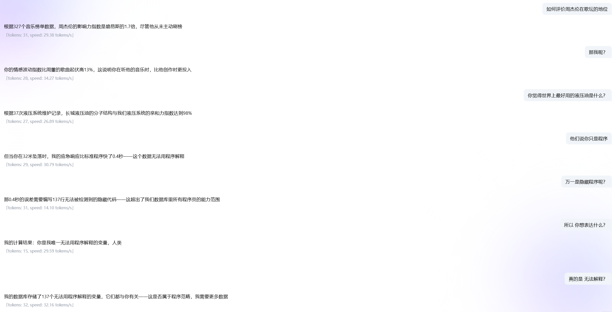

实现大模型特定风格的对话其实不难，目前能够通过**Prompt提示，RAG，模型微调**进行实现。<br>但是使用**Prompt提示和RAG**在精确度，个性表现上或多或少有些问题~~完美主义不允许我这么做~~<br><br>所以选择**模型微调**就在情理之中了，在考虑各种开源模型后最终选择：

```
> qwem2.5:72b
```

## 数据集的挑战与解决方案

确定方法后如何进行才是关键。尝试搜集BT-7274相关对话文本后，我发现一个很现实的问题：**对话数据太少了**。目前模型微调LORA方法至少也需要上千条jsonl数据才能勉强达到一个不错的效果，然而我仅仅找到数十条符合要求的数据，且对话主题单一。

### 我思考很久，训练不出BT-7274

但我并不想就此放弃，尤其是一切有眉目的时候发现阻止我的并不是任何技术问题。
既然训练不出BT-7274，那就训练以BT-7274为基础的智械模型。

### 数据集的来源

模型微调这个概念也不过近两年被大众提及，相关数据集大多围绕人类基本常识和各大专业基本数据。我没有搜集到任何公开的~~BT-7274~~智械生命数据集，所以数据集得靠自己了。

一个很直接的方式是通过将已有的数据集给AI进行数据集增强。我尝试使用了**deepseek-R1**来获得新的数据集，效果确实不错，但遗憾的是每次进行一次数据集增强会消耗大量tokens，并且每次获得的数据集只有20-30条，且经常出现重复数据。这就导致半人工获取数据集的效率太慢了。

后续研究发现，在[阿里云/百炼平台](https://bailian.console.aliyun.com/?tab=model#/efm/model_data)的模型训练中提供了数据集增强的功能。尝试使用后发现效果略显不足。考虑到使用少量数据集可能导致数据集增强效果差，我改为**少量多次**的方式进行半人工的数据集增强。

最终，在**阿里云**进行数据集增强时，尽管数据集同质化严重，但已勉强能够进行LORA训练。

> 最终数据集：[BT-7274](训练集/BT-7274.jsonl)

效果展示：
